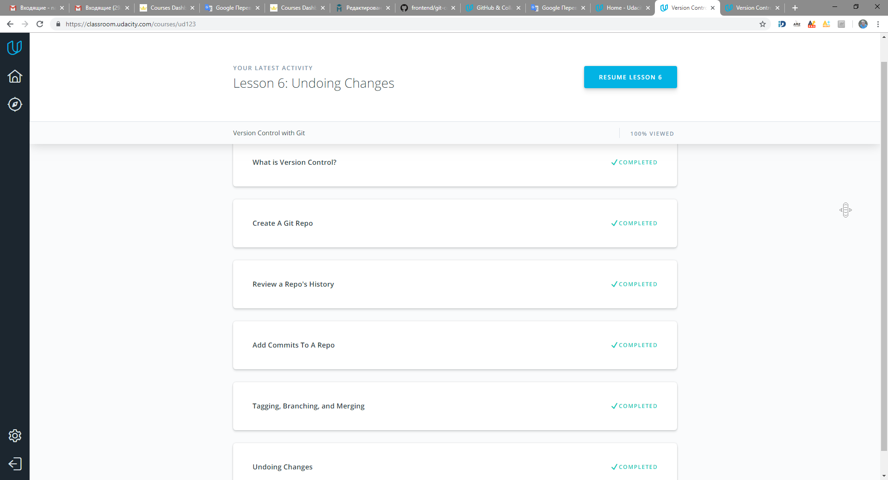

## kottans-frontend
### Front-End Course. Report

### Task 3
### Front-End Basics

> CSS - это новый дивный мир)

* [task3-1.png](/Task_Html_Css_Intro/task3-1.png)
* [task3-2.png](/Task_Html_Css_Intro/task3-2.png) 
* [task3-3.png](/Task_Html_Css_Intro/task3-3.png)

### Task 2
### Git for Team Collaboration

> Git удивительный, хочу освоить все)

 
 

### Task 1
### Linux CLI, HTTP

> Открыла для себя линукс, оказалось все намного проще чем я думала)

 
 

### Task 
### Git intro

> Это было невероятно сложно и познавательно) Git и GitHub поразили воображение, превосходная система)
> P.S. С прямыми ссылками в GitHub разберусь позже)

 

 

